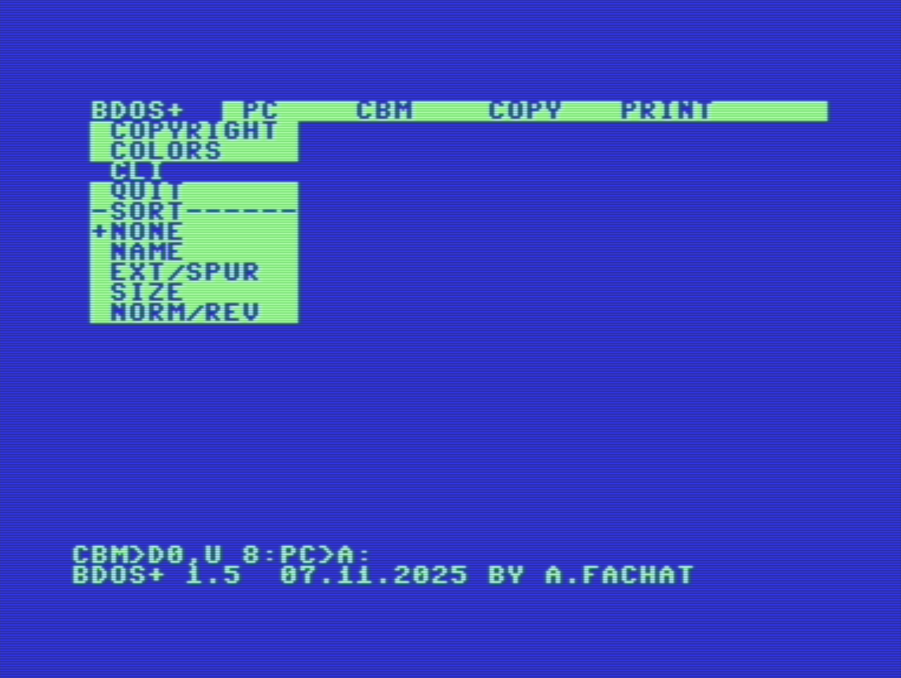
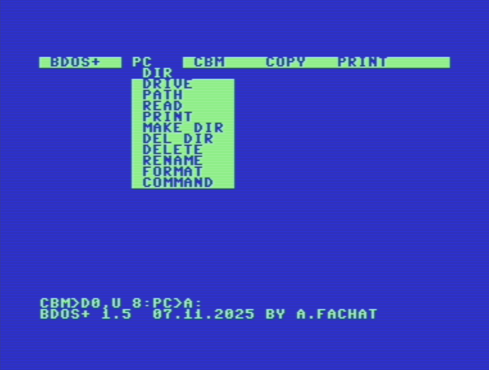
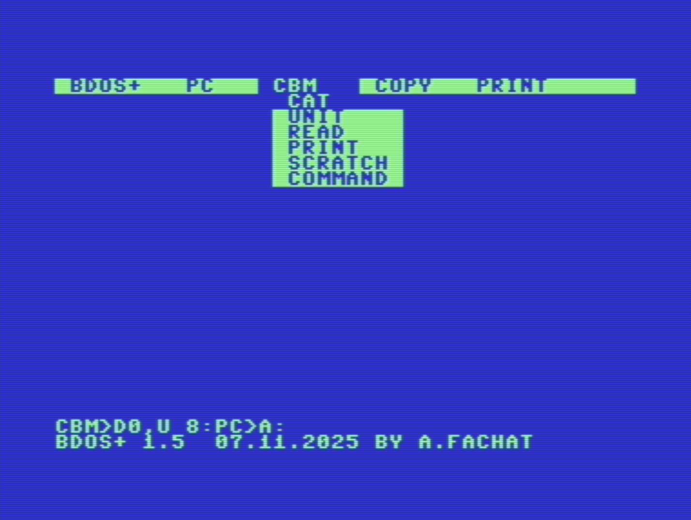
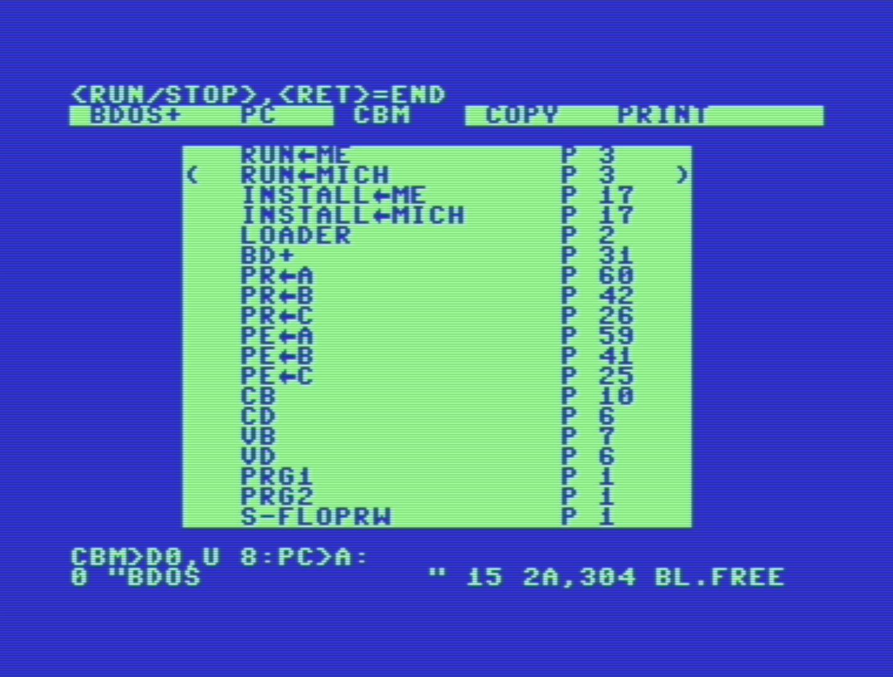
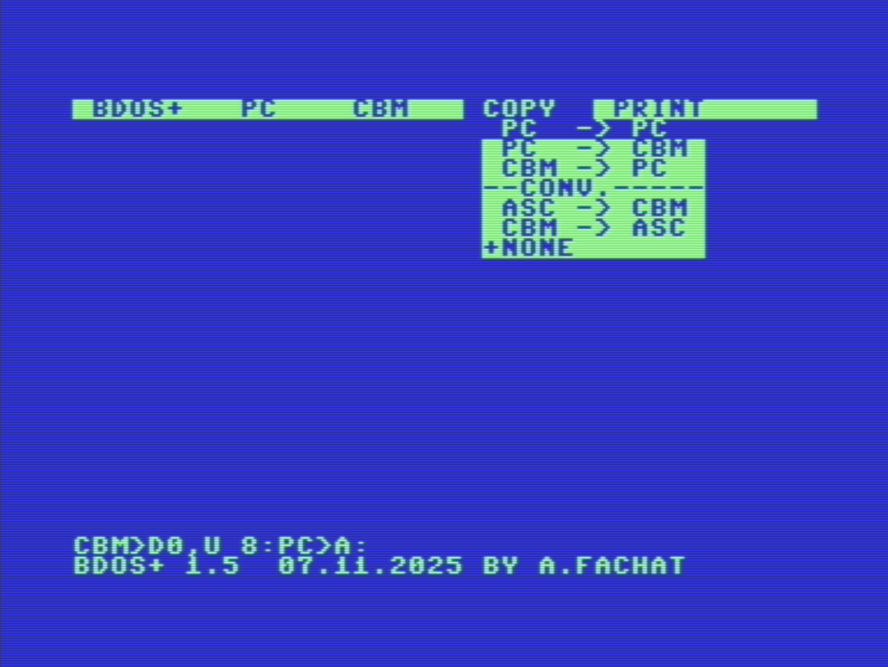
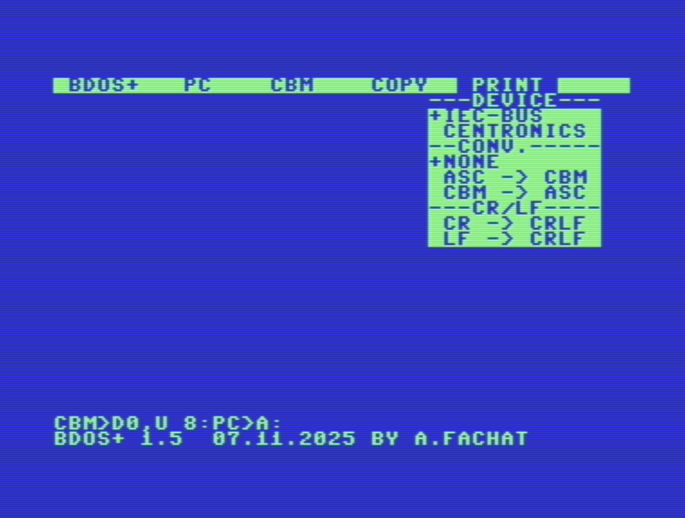

# MENU shell

The menu shell has a couple of drop-down menus that are described here.

## BDOS menu

## PC menu

This menu has items for PC disks.
You can change the drive, the path, show a file, delete, make directories, and so on.

A main thing is you can format a disk, which is especially needed for the RAM disk.

## CBM menu

This menu contains entries to show the directory (catalog), read and display files, rename or scratch them. You can also change the drive used, or send a disk command.

Directories are listed in pages, like shown in the following screenshot

## Copy menu

This menu has items to copy files from PC to PC, from PC to CBM, or vice versa.

What is important to note is that in the selection you can select multiple files,
and as a target you have to enter a directory.
Files cannot be renamed in this way.

## Printer menu

